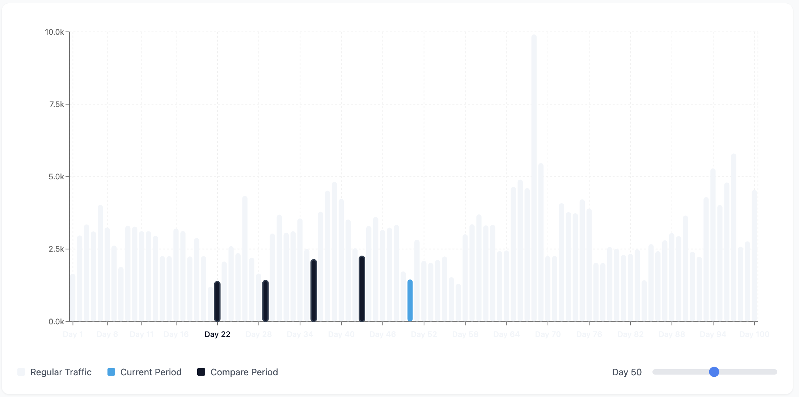

# Consume

Lynk offers several ways to consume semantic definitions from various tools.&#x20;

<figure><figcaption></figcaption></figure>

## BI tools

You can connect your BI tool to lynk via [SQL API](sql-api.md).\
